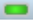

# studybuddy
MIT 6.835 Final Project\
**Contributors: **Jessica Quaye & Stuti Vishwabhan

## Introduction
There are two main types of files running the web app in our system: *.html* files and *.js* files. 

All *.js* files for the project are in a folder called **integrated**. 
We grouped the *.html* files into folders based on the different modules we have:  
- **calibrating** folder
- **testing** folder
- **studybuddy** (main) folder

The *.html* files are used to design the general outline of the page, including elements that should be visible or hidden and elements that are triggered based on user interaction. Each *.html* file that exists in the project has a corresponding *.js* file in the **integrated** folder with the same name that serves a more computation heavy purpose. 

There are other folders that are used to hold elements that are rendered in our html files: 
- **css** - contains the css file that is used to style the general outline of the system, as well as special cases for the different pages. 

- **gesture_videos** - contains the different gifs that are played on the help-gesture.html page, as well as on the calibrate-xxxx.html page (where xxxx is one of the gestures in our paper) when the user is learning how to perform the gestures. 

- **img** - contains all images that are used in the teaching component of the project. 

- **lib** - contains all libraries that are used for the project (eg. backbone, famous, leap, etc.) 

- **models** - contains the folders that hold the *.gltf* files of the models, as well as their textures.  

- **test_images** - contains all images that are used in the testing component of the project. 		

- **three-js**  - contains the entire Three.js library, including all its submodules and examples. 

## Instructions for setting up and running code
**NB**: Users will need an internet connection and a LeapMotion Sensor for the system to completely run.
 
1. Clone or download the **studybuddy** directory.
2. Plug in the LeapMotion sensor into a USB port, and watch the status bar of your computer until the black leap icon  turns to green . If you are unsure about the status, click on the green icon and select “Visualizer” from the dropdown menu to ensure that the hardware is completely set-up.
3. Using terminal on your machine, cd into the studybuddy directory. For example, if the studybuddy folder is on your Desktop, run:
	`cd Desktop/studybuddy`
4. After this, run `python -m http.server` (We used python3)
5. Then, open your web browser and type in:
	[http://localhost:8000/home.html](http://localhost:8000/home.html)
6. This should get the system up and running - enjoy! 

**NB**: Please click (anywhere) in the page before you ask the system to tell you something. Google requires that users do this to prevent abuse of their API and the computer will not say anything to you without that click.
